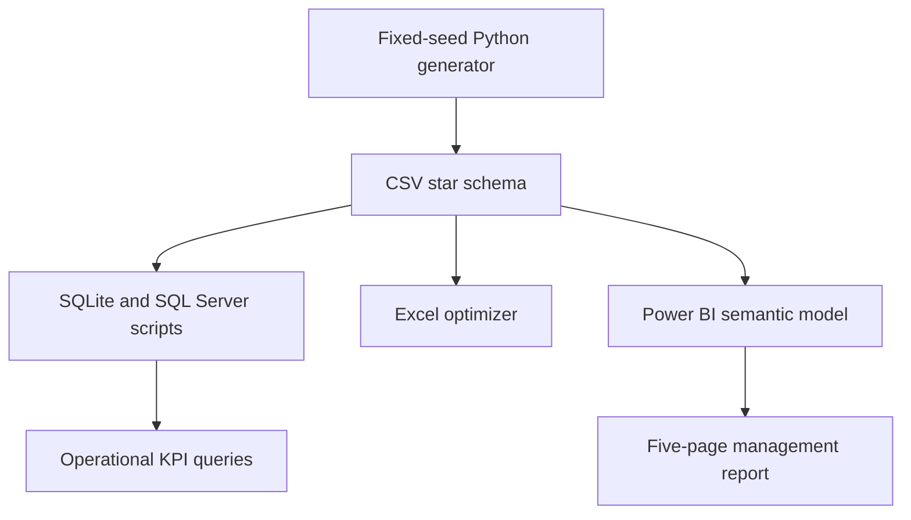
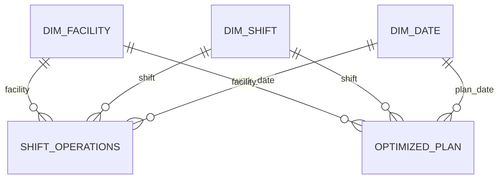

# Demand-Based Workforce & Shift Capacity Optimizer

[](powerbi/Demand_Based_Workforce_Optimizer.pbip)
[](src/)
[](LICENSE)

A portfolio-ready workforce planning and supply-chain analytics project built with Power BI, Python, SQL, SQLite, and Excel. It recommends the full-time, contract, and overtime workforce required across five fulfilment centres and three daily shifts while maintaining a 3% capacity safety buffer.

> All organisations, facilities, demand volumes, wage rates, and results in this repository are synthetic and reproducible. The reported savings are simulated scenario outputs, not realised company savings.


## Project results

| KPI | Baseline | Optimized | Improvement |
| --- | ---: | ---: | ---: |
| Direct labour cost | INR 23,126,455.54 | INR 21,683,097.83 | INR 1,443,357.71 saved |
| Cost reduction | — | — | 6.24% |
| Overtime hours | 456 | 148 | 67.54% lower |
| Safety-buffer shortfalls | 250 | 0 | 100% removed |
| August forecast orders | — | 1,301,353 | Fully covered |

## Power BI report

The repository contains a complete Power BI Desktop Project rather than only screenshots or build instructions.

| Page | Decision supported |
| --- | --- |
| Executive Overview | Network-level costs, savings, overtime, and staffing summary |
| Demand & Capacity | Forecast demand, target capacity, utilization, and shortfall analysis |
| Workforce Plan | Recommended FTE, contract, and overtime allocation |
| Cost Optimization | Baseline-versus-optimized cost and savings analysis |
| Historical Operations | Processing, backlog, absence, productivity, and forecast accuracy |

The report includes 55 visuals, 36 DAX measures, six tables, six relationships, and date/facility/region/shift slicers. Its 1,976 source rows are embedded in the Power Query partitions, so the PBIP does not depend on a local CSV path or credentials.

## Quick start

### Open the Power BI report

1. Download or clone this repository.
2. Install a current version of Microsoft Power BI Desktop.
3. Open [`powerbi/Demand_Based_Workforce_Optimizer.pbip`](powerbi/Demand_Based_Workforce_Optimizer.pbip).
4. Allow the semantic model to load and refresh.
5. To create a single binary file, select **File > Save As > Power BI Desktop file (`.pbix`)**.

If an older Power BI Desktop release does not recognize the project, update Desktop or enable the Power BI Project, TMDL, and enhanced report format preview options.

### Validate the repository

The validation scripts use only the Python standard library:

```bash
python src/validate_project.py
python src/validate_repository.py
```

The supplied project has passed Microsoft report-definition validation with zero errors and zero warnings. Its TMDL semantic model was also re-imported successfully with all tables, measures, and relationships detected.

### Query the SQLite model

Open [`database/workforce_optimizer.sqlite`](database/workforce_optimizer.sqlite) in SQLiteStudio or DB Browser for SQLite, then run [`sql/05_analysis_queries_sqlite.sql`](sql/05_analysis_queries_sqlite.sql).

### Use the Excel optimizer

Open [`excel/Demand_Based_Workforce_Shift_Capacity_Optimizer.xlsx`](excel/Demand_Based_Workforce_Shift_Capacity_Optimizer.xlsx). It contains an executive dashboard, shift plan, Solver-ready scenario, KPI calculations, assumptions, and source-data sheets.

## Architecture



The semantic model uses shared facility, shift, and date dimensions for historical execution and the optimized August plan.



## Optimization logic

For every facility-shift-day, the generator evaluates integer combinations of FTE workers, contract workers, and overtime subject to:

- Capacity must be at least forecast demand × 1.03.
- FTE and contract assignments cannot exceed facility limits.
- Overtime cannot exceed 40 hours per facility-shift-day.
- All workforce decisions are non-negative integers.

The planning score minimizes direct labour cost plus an overtime-risk penalty of INR 420 per hour. The penalty represents fatigue and quality risk; reported savings compare direct wages only.

## Repository structure

```text
.
├── .github/                    Issue templates, PR template, and CI workflow
├── data/
│   ├── raw/                    Dimensions and historical shift operations
│   └── processed/              Optimized August plan and summaries
├── database/                   Ready-to-query SQLite database
├── docs/                       Requirements, dictionaries, interview guide, PDF, images
├── excel/                      Finished optimizer workbook
├── powerbi/                    Complete PBIP, DAX library, theme, and build guide
├── sql/                        SQL Server and SQLite scripts
├── src/                        Data generation, report building, and validation
├── validation/                 Power BI validation summary
├── CONTRIBUTING.md
├── GITHUB_SETUP.md
├── LICENSE
└── README.md
```

## Reproducibility

The synthetic-data generator uses the fixed seed `26082026`.

```bash
python src/generate_dataset.py
python src/validate_project.py
```

Regeneration rewrites the supplied CSVs and SQLite database with the same deterministic scenario.


## Limitations and next steps

This project plans aggregate workers rather than named employees. A production version should add skill matrices, weekly-hour and leave rules, forecast uncertainty, demand scenarios, labour-law constraints, and a mixed-integer optimizer across connected shifts.

## License

Released under the [MIT License](LICENSE).
